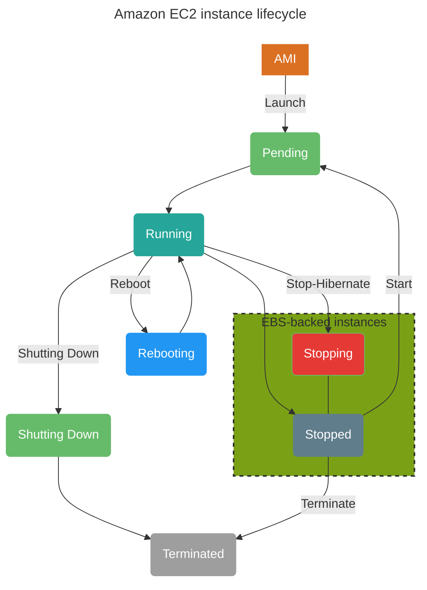
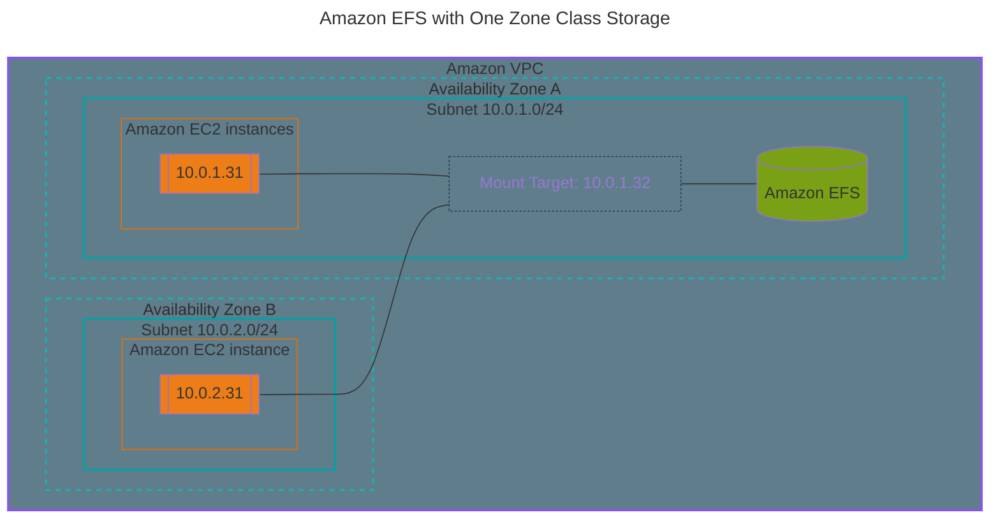

---
aliases:
  - AWS Certified Solutions Architect - Associate
  - SAA-C03
cssclasses:
  - Centered_Images
  - Centered_Tables
  - Rounded_Corners
date: 0205-06-06
tags:
  - Article
permalink: 41c5e4d4-c608-4387-b711-cdc0da8cf86b
---

I just passed my AWS (Amazon Web Services) [SAA-C03](https://www.credly.com/badges/7566a7b4-b78d-43af-8450-db5f9ebffebc) (Solutions Architect Associate) exam! It was hard work over the course of many months and late night studying. Today I wanted to share how I passed, some learning outcomes and fun extras.

The journey started late last year when my co-worker and I decided we wanted to go for this certification. Currently we both conduct Cloud Risk Assessments and wanted to expand our knowledge. As AWS is the larger enterprise cloud provider we thought it was a good fit.

We chose "[Solutions Architect Associate](https://aws.amazon.com/certification/certified-solutions-architect-associate/)" since it is focused on the design of cost and performance optimized cloud solutions. It was also a great opportunity to learn more about AWS services in general (passed [Certified Cloud Practitioner](https://aws.amazon.com/certification/certified-cloud-practitioner/) which [I already had](https://www.credly.com/badges/89e07fe5-3a2e-4263-bcf5-79f368b4fc23)).
## How I passed
The main resources I used were:

| Resource                                                                                                                                                                                                                                                                                                                                 | Value                                                                                                    |
| ---------------------------------------------------------------------------------------------------------------------------------------------------------------------------------------------------------------------------------------------------------------------------------------------------------------------------------------- | -------------------------------------------------------------------------------------------------------- |
| [AWS Certified Solutions Architect - Associate (SAA-C03) Exam Guide](https://d1.awsstatic.com/training-and-certification/docs-sa-assoc/AWS-Certified-Solutions-Architect-Associate_Exam-Guide.pdf)                                                                                                                                       | Gives you an outline of exam objectives and services to study.                                           |
| [AWS Skill Builder Knowledge Badges](https://skillbuilder.aws/)                                                                                                                                                                                                                                                                          | Good source of official AWS practice questions.                                                          |
| r/AWSCertifications                                                                                                                                                                                                                                                                                                                      | Great community of people that share study tips and more.                                                |
| [Stephane Maarek \| Udemy \| Practice Exams \| AWS Certified Solutions Architect Associate](https://www.udemy.com/course/practice-exams-aws-certified-solutions-architect-associate/)                                                                                                                                                    | Great source for harder practice questions                                                               |
| [AWS Certified Solutions Architect Associate Practice Exams SAA-C03 2025 \| Tutorials Dojo](https://portal.tutorialsdojo.com/courses/aws-certified-solutions-architect-associate-practice-exams/)                                                                                                                                        | Realistic practice exams to the real test!                                                               |
| [Obsidian](https://obsidian.md/)                                                                                                                                                                                                                                                                                                         | Stored all my AWS SAA notes                                                                              |
| [Be A Better Dev \| YouTube](https://www.youtube.com/@BeABetterDev/playlists)\|                                                                                                                                                                                                                                                          | Great videos that explain tough topics. (Like [SNS vs SQS](https://www.youtube.com/watch?v=RoKAEzdcr7k)) |
| [AWS Whitepapers](https://aws.amazon.com/whitepapers/?whitepapers-main.sort-by=item.additionalFields.sortDate&whitepapers-main.sort-order=desc&awsf.whitepapers-content-type=*all&awsf.whitepapers-global-methodology=*all&awsf.whitepapers-tech-category=*all&awsf.whitepapers-industries=*all&awsf.whitepapers-business-category=*all) | Great official source for AWS service descriptions and how they work.                                    |
| [Anki](https://apps.ankiweb.net/)                                                                                                                                                                                                                                                                                                        | Opensource flashcards tool.                                                                              |
**General Study Strategy**:
1. Review all ~81 in scope services from the AWS Exam Guide.
	- Look up each service in the "*Overview of Amazon Web Services*" Whitepaper and write the definition of the service in your own words. Also add notes on how it connects to other services all within Obsidian.
2. Convert those notes into services flashcards with Anki.
3. Take a practice exam in timed mode to simulate the real exam.
4. Review the questions you got wrong and study on why you got it wrong.
	- Add additional notes to your Obsidian services notes based on that.
	- Look up YouTube videos explaining services you got wrong in more detail.
5. Continue that cycle with practice exams until you get a score you like.
6. Book the real exam and pass!
## Learning Outcomes
I learned a lot about many services new to me within AWS:
- AWS Glue
- Amazon Kinesis
- Amazon EventBridge
- Amazon Simple Notification Service (Amazon SNS)
- Amazon Simple Queue Service (Amazon SQS)
- AWS Control Tower
- AWS Global Accelerator
- Amazon FSx
- AWS Storage Gateway
- And many more! (~81 Total)

You definitely get a great understanding of AWS's foundational services and how they work and when to use them together. Like block and object storage, and how they connect to different databases and all the security and networking in between.

Over all I would recommend the SAA to anyone that wants to learn more about AWS and its core services. Especially if you want to go into a career area that is heavily involved with the cloud. Whether its development, GRC or general IT I think this has a place for all of them.
## Fun extras

### Obsidian Node Graph of All SAA Notes
- 100+ Files, 20+ Folders, All linked with related topics and terms from AWS.

### Custom Made Mermaid Charts from Notes
During my study I would practice learning service workflows by re-making them as custom mermaid chats.

> [`mermaid.js`](https://mermaid.js.org/intro/) is an opensource "Chart as Code" tool that allows you to create and store custom charts in `plaintext` and is support on many tools such as [Obsidian](https://help.obsidian.md/credits#Mermaid).

---

---
**AWS Chart References**
- ["Amazon EC2 instance state changes"](https://docs.aws.amazon.com/AWSEC2/latest/UserGuide/ec2-instance-lifecycle.html)
- ["Mounting file systems with One Zone file system on other AWS compute instances"](https://docs.aws.amazon.com/efs/latest/ug/mounting-one-zone.html#mounting-one-zone-other-compute-instances)