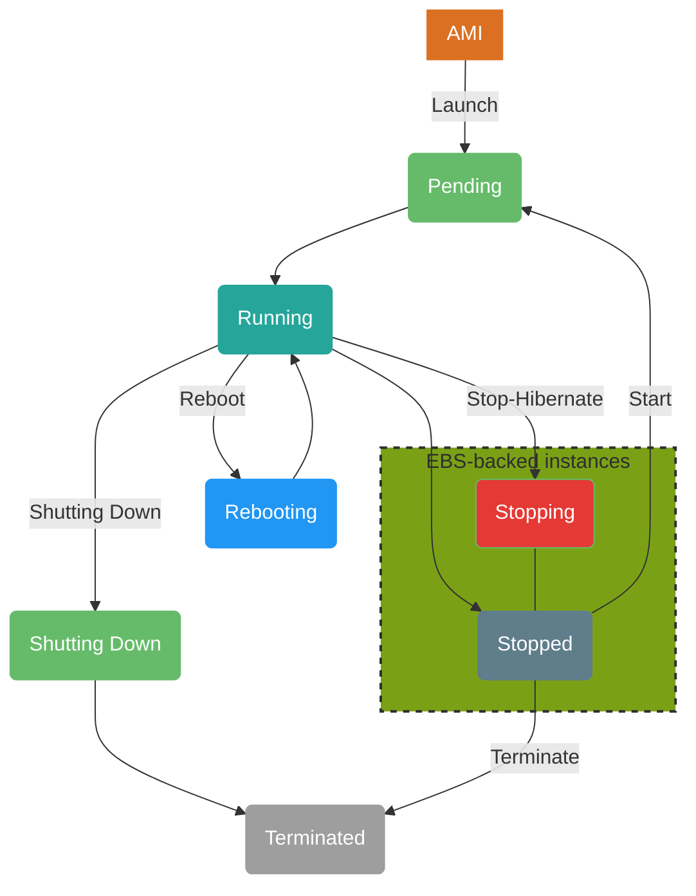
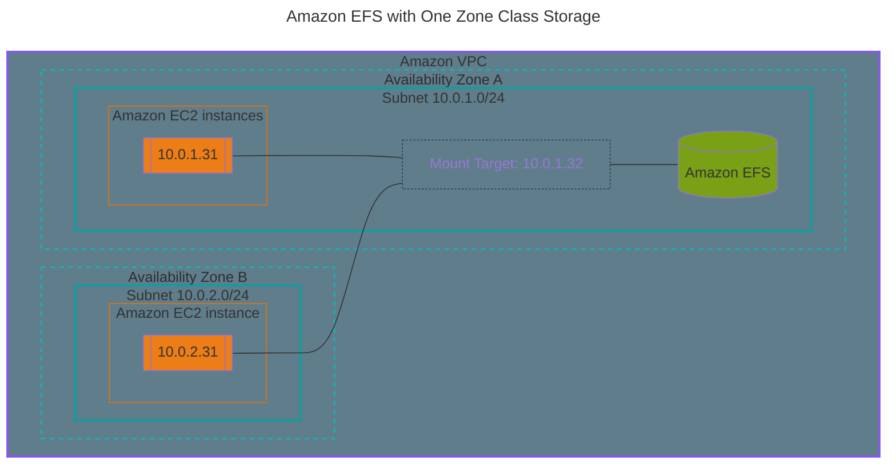

```mermaid
graph TD
H[[AMI]]
A(Rebooting)
B(Running)
C(Stopping)
D(Stopped)
E(Pending)
F(Shutting Down)
G(Terminated)


A --> B
E --> B -- Shutting Down --> F --> G
D -- Terminate --> G
H -- Launch --> E
D -- Start --> E
B --> D
B -- Reboot --> A
B -- Stop-Hibernate --> C

subgraph A1["EBS-backed instances"]
C --- D
end

style A fill:#2196f3,stroke:#2196f3,color:#ffffff
style B fill:#26a69a,stroke:#26a69a,color:#ffffff
style C fill:#e53935,stroke:#66bb6a,color:#ffffff
style D fill:#607d8b,stroke:#607d8b,color:#ffffff
style E fill:#66bb6a,stroke:#66bb6a,color:#ffffff
style F fill:#66bb6a,stroke:#66bb6a,color:#ffffff
style G fill:#9e9e9e,stroke:#9e9e9e,color:#ffffff
style H fill:#db7023,stroke:#db7023,color:#ffffff


style A1 fill:#7aa116,stroke:#2e2e2e,stroke-width:2px,color:#2e2e2e,stroke-dasharray: 5 5
```

---

```mermaid
---
title: Amazon EFS with One Zone Class Storage
---
graph TD
subgraph a1[Amazon VPC]
subgraph AZA[Availability Zone A]
subgraph S101[Subnet 10.0.1.0/24]
subgraph EC213[Amazon EC2 instances]
EC2B[[10.0.1.31]]
end
MTA[Mount Target: 10.0.1.32]
EC2B --- MTA
AEFS[(Amazon EFS)]
MTA --- AEFS
end
end
subgraph AZB[Availability Zone B]
subgraph S102[Subnet 10.0.2.0/24]
subgraph EC241[Amazon EC2 instance]
EC2D[[10.0.2.31]]
end
end
EC2D --- MTA
end
end


style a1 stroke:#8c4fff,fill:#607d8b,stroke-width:2px

style AZA stroke:#1caeb0,stroke-width:2px,color:#2e2e2e,stroke-dasharray: 5 5,fill:#607d8b
style AZB stroke:#1caeb0,stroke-width:2px,color:#2e2e2e,stroke-dasharray: 5 5,fill:#607d8b

style S101 stroke:#00a4a6,stroke-width:2px,fill:#607d8b
style S102 stroke:#00a4a6,stroke-width:2px,fill:#607d8b

style EC213 stroke:#ed7100,fill:#607d8b
style EC241 stroke:#ed7100,fill:#607d8b

style MTA stroke:#0a415b,stroke-dasharray: 2 2,fill:#607d8b,color:#9778d4

style EC2B fill:#ed7d17
style EC2D fill:#ed7d17

style AEFS fill:#7aa116
```

---

