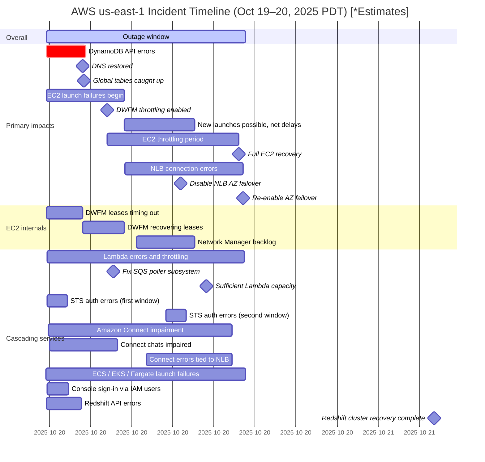

### What happened?

Early Monday morning AWS announced they were having some issues in the N. Virginia (us-east-1) Region. During this time platforms like Snapchat, Signal and Fortnite were all having issues, and by mid day even Amazon's own consumer services were having problems.

The main reason for this was:
- The increased error rates of the Amazon DynamoDB API.
- Network Load Balancer (NLB) having increased connection errors.
- Some new EC2 launches failed and the ones that didn't also had connectivity issues.

#### DynamoDB

The main cause of API call errors was an issue with the services automated DNS system which lead to failures to resolve the DynamoDB API. The issue was caused by a ***latent race condition*** which lead to an edge case of the system creating an incorrect empty DNS record for the regional endpoint `dynamodb.us-east-1.amazonaws.com` which lead to the failure to repair said record.

> [!Abstract] Latent Race Condition
> *A latent race condition is a race condition vulnerability that is not immediately obvious and may only occur under specific, often infrequent, timing or network conditions.*

At a high level this was caused by the AWS DNS Enactors. These Enactors are split across 3 different availability zones for redundancy and updated DNS plan records as changes are made. Unfortunately do to the latent race condition which was the event of longer latency to update the DNS record the expected. The enactor tried to update a record with an old DNS plan. Which Then lead to it being deleted immediately by another DNS enactor (Since it thought it was outdated). This created an empty DNS record being saved and the IPs for the us-east-1 region deleted. This left the system in a failure state that required AWS engineers to intervene to fix the issue.

This lead to DNS failures for all requests to DynamoDB in the N. Virginia (us-east-1) Region via their public endpoint. This also includes internal AWS services traffic that is dependent on DynamoDB as well.

> [!quote] AWS:
> *"Customers with DynamoDB global tables were able to successfully connect to and issue requests against their replica tables in other Regions, but experienced prolonged replication lag to and from the replica tables in the N. Virginia (us-east-1) Region."*

> I think it's important to note that *only* the N. Virginia (us-east-1) Region was affected by this.

This was the main AWS service outage event for the day.

> [!Bug] DynamoDB Timeline
> 12:38 AM Root cause identified, 2:25 AM Fixed

#### Amazon EC2 & NLB

New Amazon EC2's being deployed ran into issues during this outage as well (Already deployed EC2's were fine during the outage). The root cause was the Amazon EC2 subsystem DropletWorkflow Manager (DWFM), which is dependent on DynamoDB to function. This subsystem manages the underlying physical server hardware EC2 runs on and is ran right before a new EC2 deployment. Since the droplet backlog queue of new EC2 instances got so backed up, the jobs timed out and failed before they could be deployed. Hence the errors with new EC2's.

> [!Bug] EC2 Timeline
> 2:25 AM Root cause identified (DWFM lease failures after DynamoDB outage), 1:50 PM Fixed  

After DWFM was recovered this lead to the Network Manager subsystem to fail as the queue got so backed up with failed EC2 launch configurations it could not keep up. This lead to AWS engineers to enable a throttling on new EC2 requests while the issue was manually resolved. This also lead to issues with Amazon Network load balancers (NLB) and other AWS services throughout the day.

> [!Bug] NLB Timeline
> 6:52 AM Root cause identified (health check failures), 2:09 PM Fixed  

#### Other AWS Services
This AWS outage had a larger effect on the greater AWS ecosystem as well, since so many services rely on DynamoDB and other interconnected systems.

The official AWS report mentions multiple AWS services were impacted due to dependencies:
- Amazon Simple Storage Service  
- Amazon Virtual Private Cloud  
- AWS Identity and Access Management  
- AWS Lambda  
- Amazon Relational Database Service  
- Amazon CloudWatch  
- AWS CloudFormation  
- Amazon SageMaker  
- Amazon GuardDuty  
- AWS Systems Manager
- And Impacted 131 more services...

### Full Timeline of Events

### What is AWS doing about it?
AWS already stated that it plans to fix the race condition mentioned and will be adding several new protections to prevent applications from using incorrect DNS record plans.

For NLB, they plan to add more safety controls to the NLB health checks during an AZ failover.

For EC2, they are building additional scaling testing stages that will use the DWFM recovery workflow to identify any future regressions. They will also be updating the throttling mechanism to better rate limit incoming work based on the current size of the queue to better protect the service during high load.

Finally, at a high level, they said they will be looking at this outage event across all impacted services to find more ways to avoid the impact of a similar event and work on reducing the time to recovery as well.

### What could you do to prevent this?

As someone who recently got their [SAA-C03](saa-c03/index.md). I wanted to share my thoughts on how this type of outage could have been prevented.

- Don't put all your resources in one region:
	- Many company's heavily relay on `us-east-1` do to its convenience, low latency and new features. But this creates a massive single point of failure for your business.
	- Lots of people think having multi-AZ environment within one region is enough but when you get a ***regional*** control-plane failure (like DNS) this can still take everything down.
- Understand when to use abstraction tools wisely:
	- When you decide to use a managed services such as a database provider etc. You are adding another layer in your businesses environment that could lead to a potential failure.
- Map your dependencies:
	- Take a look at your network diagrams and understand what parts of your system will go down when core services break. Map these out and understand them.
- Start Architecting a regional failover solution:
	- When I was studying for my SAA I learned about how AWS Route53 has multiple routing types:

> [!Abstract] My SAA notes on: Route 53
>
>"***Multi-Region failover***
>*You can have a mirror of your environment in another region and route 53 can start sending traffic over if the main region goes down.*
>
> - **Latency Routing**
> 	- *Routes traffic based on lowest latency (Not always in the same geographic region.)*
> - **Geoproximity Routing**
> 	- *Routes traffic based on the geographic location of your **resources**.*
> 	- *You can specify a certain resources to receive more traffic, this is done by increasing its **Bias** value.*
> - **Geolocation Routing**
> 	- *Routing based on the location of the end **user**.*
> - **Weighted Routing**
> 	- *You can associate resources to a specific domain and route.*"

- Test Test Test! (Tabletops!):
	- Run tabletops on your disaster recovery plans with your leadership on a consistent cadence to practice these incidents before they happen.
	- Example: Run regular “turn off us-east-1” exercises in staging.
- Work on your MTTR!
	- Know your businesses goal of what you want your mean time to recovery to be!

> [!Abstract] My Security Plus notes on: MTTR
> ###### Mean time to repair (MTTR)
> - Mean time to repair (MTTR), also known as mean time to recovery, is the average time for a system or device to recover from a failure

- Give your clients a fallback config!
	- Build redundancy into your clients configuration with a fall back config from another region that your client can talk to during a primary endpoint failure because of a DNS outage.
	- Your clients should also be able to "break gracefully" to minimizes disruption.
- Avoid single-region dependencies
	- Keys, ID Flags and more should be replicated to a second region if you want failover to work.
- Budget for people and process, not just replicas.
	- Creating a multi-region redundant plan is not just about duplicating infrastructure across regions, its about duplicating your people on call for each region and managing two separate playbooks and making sure both are tested individually. Be sure to budget for these operational costs as well and calculate what makes sense for your business.
### Sources

> [!Info]
> - [Multiple services (N. Virginia) - October 20, 2025 - Disrupted | AWS Health Dashboard](https://health.aws.amazon.com/health/status?eventID=arn:aws:health:us-east-1::event/MULTIPLE_SERVICES/AWS_MULTIPLE_SERVICES_OPERATIONAL_ISSUE/AWS_MULTIPLE_SERVICES_OPERATIONAL_ISSUE_BA540_514A652BE1A)
> - [Summary of the Amazon DynamoDB Service Disruption in the Northern Virginia (US-EAST-1) Region | AWS](https://aws.amazon.com/message/101925/)
> - [Why the Web was Down - Explained by a Retired Microsoft Engineer | Dave's Garage](https://www.youtube.com/watch?v=KFvhpt8FN18)
> - [Should we break up AWS over the us-east-1 outage? | Theo - t3․gg](https://www.youtube.com/watch?v=AORIZL-jGDM)