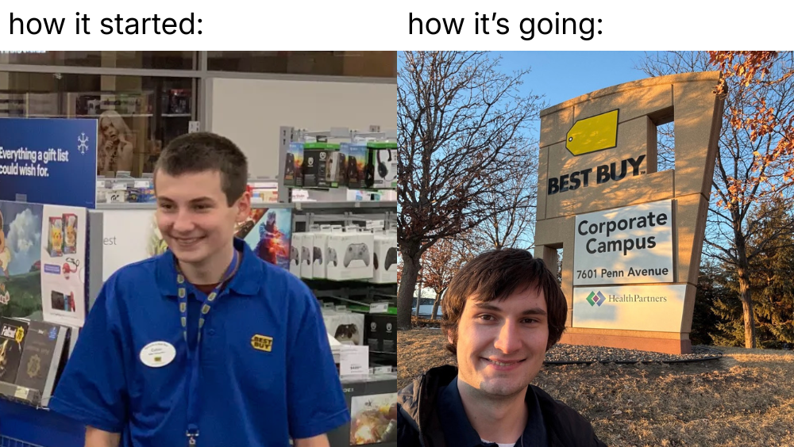

**Career Update**: After a short hiatus, I have accepted a new job as a Cybersecurity Risk Analyst for the Best Buy Third Party Risk Management team! As some of you may know I started my professional career at [Best Buy Retail](../../../articles/2025/my_time_at_bestbuy/index.md) as a [Computer Sales Consultant](../../../../about_me/Resume/Best%20Buy%20Timeline.md#Computer%20Sales%20Consultant%20(Store%2011)). I am excited to start my next chapter of my career and continue my Best Buy journey. Best Buy has been a major innovator in the retail space for years now with their goal of enriching peoples lives through technology. I am excited to join team blue once again and help enable future innovations while keeping it secure.

<p align="center"></p>

> [!cite]- Post Permalink
> ```
> blog.calvinschmeichel.com/1fd7d597-0805-4cae-b43e-407eb3ef962b
> ```

> [!cite]- LinkedIn Mirror
> https://www.linkedin.com/posts/calvinschmeichel_career-update-i-have-accepted-a-new-job-activity-7428925300618473472-DrgA