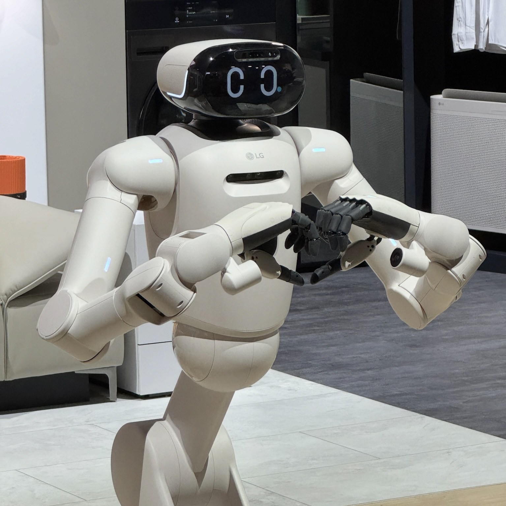
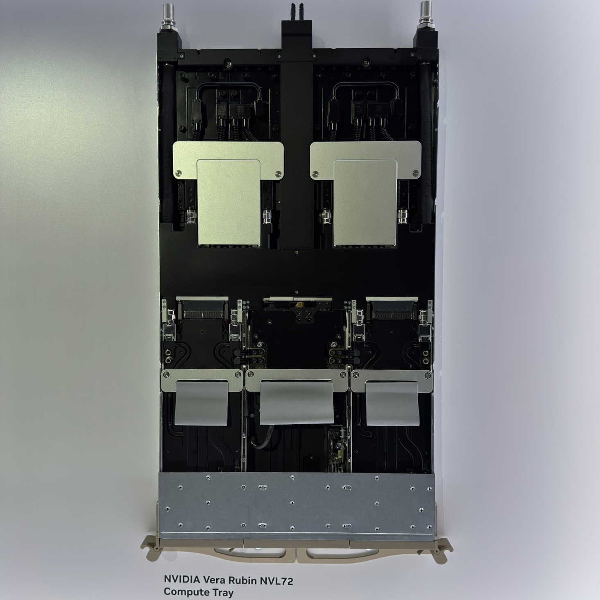
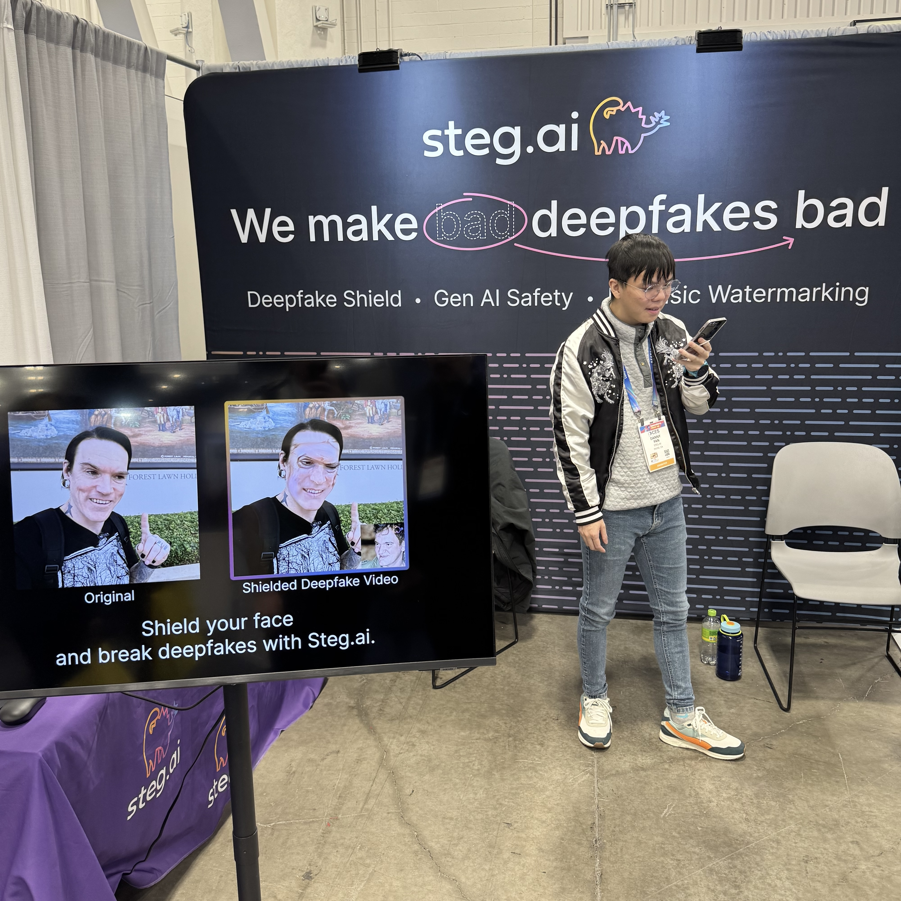
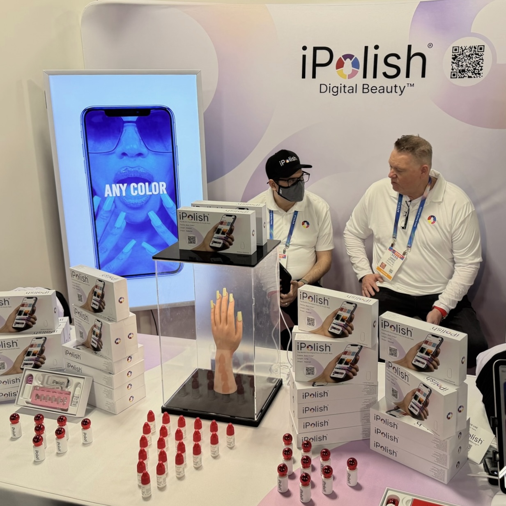
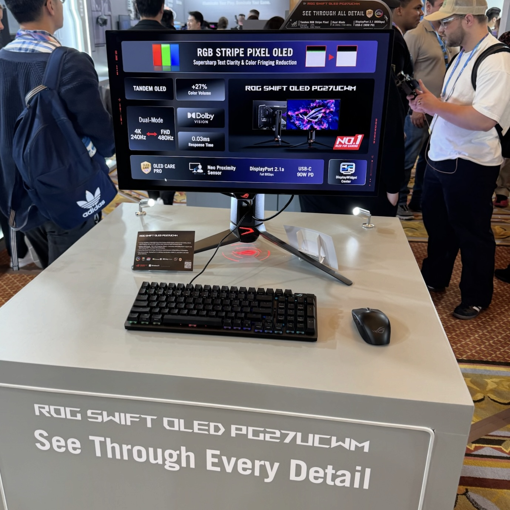
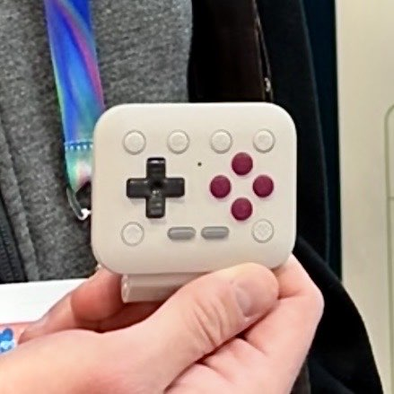

### I went to CES 2026!

I had the privilege to attend CES once again in 2026. As always, it was a great showcase of emerging technologies that we will (maybe) see in the future. These are some of my favorite picks from the show.

### LG CLOiD Home Robot

LG announced and showed off its new LG CLOiD robot, which they claim is a “Zero Labor Home” robot to help with tasks at home. On the show floor, LG had a live demo running of the bot inside a laundry room, with a video playing of multiple examples of use cases. One case was being able to call the bot to start some tasks, such as putting food in the oven, prepping gym clothes on the couch, etc. Another one was general cleaning, such as finding your car keys on the floor and putting them away, and also the ability to control other smart devices in your home, such as a smart vacuum, sort of becoming a command center for your smart home.

The biggest thing will be cost with this product. I think the concept of a humanoid robot that does the mundane tasks for you around your home is appealing, but the cost will be a major factor.

> [!attention] **Cybersecurity Perspective**: Robot & IoT Endpoint Security  
> As our homes become even more connected into the future, security of these devices becomes even more important. If humanoid robots become the norm, could this lead to an evolution of social engineering? Imagine a world where there is a robbery in your home because someone was able to trick your robot into opening the door and turning off the camera system.

> [!info] The Problem with this Humanoid Robot  
> Here is a great video on the debate between humanoid robots vs. robots made for a specific purpose (Roomba)
> 
> 
<iframe width="560" height="315" src="https://www.youtube.com/embed/j31dmodZ-5c?si=8l4x3BCJotCx2aD4" title="YouTube video player" frameborder="0" allow="accelerometer; autoplay; clipboard-write; encrypted-media; gyroscope; picture-in-picture; web-share" referrerpolicy="strict-origin-when-cross-origin" allowfullscreen></iframe>

[source](https://www.lg.com/global/newsroom/news/home-appliance-and-air-solution/lg-electronics-presents-lg-cloid-home-robot-to-demonstrate-zero-labor-home-at-ces-2026/)

### NVIDIA Vera Rubin

NVIDIA launched their new Rubin platform for the data center with a focus on AI training and inference efficiency. The Rubin platform aims to accelerate mainstream AI adoption by providing a cost-effective and scalable solution for building and deploying advanced AI systems.

> [!attention] **Cybersecurity Perspective**: Security of the AI Datacenter  
> As the AI bubble continues to grow and the AI spend on these data centers does as well, it’s important to take a look at what security of the datacenter looks like. If your organization is renting compute with a provider, make sure you understand where your data is going and what data protections you have put in place.

> [!info] Google Data Center Security: 6 Layers Deep  
> This is still one of my favorite datacenter security videos:
> 
> 

[source](https://nvidianews.nvidia.com/news/rubin-platform-ai-supercomputer?ncid=no-ncid)

### steg.ai

steg.ai is a steganography product that allows you to digitally watermark your images with a [C2PA content credential](https://c2pa.org). This can better allow you to detect edits to an image as well as help prevent leaks to the internet via DLP. Additionally, in the unfortunate case where there is a leak, you can use these digital watermarks as a tracker to see where the leak originated from.

On the show floor today, they were showing off a new product that “poisons” your facial data within an image, so if it gets uploaded to a deepfake tool it fails to create a successful output (the video gets completely dismantled). I think this technology could be promising, but I think the real challenge is the cat-and-mouse game as these AI tools get better at circumventing these protections.

> [!attention] **Cybersecurity Perspective**: Potential DLP (Data Loss Prevention) use-case  
> I could see this technology being added to DLP tools as another way to protect sensitive data from being leaked to the internet or exfiltrated from the corporate network. I’m sure DLP tools out there already have similar adjacent technologies, but I would be curious to compare.

[source](https://steg.ai/news/ces-2026-recap/)

### iPolish

iPolish launched their new “Smart Nails” product, which are temporary nails that can be electronically color-changed on the fly within seconds. This allows for shifting between more than 400 shades of color while only taking about 5 seconds per color shift.

> [!attention] **Cybersecurity Perspective**: Biometric Manipulation and Social Engineering  
> While this technology is still new and emerging, it’s important to take note of it, especially for physical security. How could this be used for a physical pen test? What other technologies could emerge that change a person’s outfit on the fly that could help them stay undercover? Just food for thought.

[source](https://ipolish.fashion/blogs/news/ipolish-smart-nails-steal-spotlight-at-ces-2026)

### ASUS ROG Swift OLED PG27UCWM

ASUS teased their new OLED monitors late last year with this teaser:

This got me very excited. As someone who owns an LG OLED TV at home, I appreciate the true blacks and color accuracy of OLED. The issues I was having with all of the 27in variants so far that have come out is the [non-standard subpixel layout](https://youtu.be/_jGtEqkenBg&t=559), which for some people (including me) leads to having a hard time reading text clearly, while others read text just fine.

But these new OLED panels that LG Display has developed with a standard RGB subpixel layout mean that text fringing is gone. I was able to test this myself in person, and I can confirm it looks great.

The ASUS ROG Swift OLED PG27UCWM monitor uses a tandem OLED panel with `0.03ms` response times and a “Dual-Mode” feature, which allows the monitor to do `4K@240Hz` and `FHD@480Hz`, which is amazing. The panel color quality looked great in person as well.

> *This might need to be my new monitor*

> [!info] Not One, But 𝗧𝗪𝗢 RGB-Stripe OLED Monitors (QD-OLED & WOLED) from ASUS!  
> More great coverage from one of my favorite display reviewers:
> 
> 

[source](https://press.asus.com/news/press-releases/rog-rgb-oled-ces-2026/)

### 8BitDo FlipPad

Finally, 8BitDo showed off their new “FlipPad” device, a USB-powered gamepad for your mobile phone. This allows you to use real tactile buttons instead of traditional touchscreen controls, which don’t feel as intuitive or easy to play with. The main appeal of this device is the fact that it becomes part of your phone, so you can hold it while on the go. It’s not a separate controller that you need to hold while your phone is on a kickstand, etc. I had a vision of a device like this years ago and wished someone had made it, and here we are. 8BitDo claims it’s coming this summer, and I am excited to get my hands on it again when it fully releases.

[source](https://www.theverge.com/tech/854303/8bitdo-mobile-smartphone-controller-ios-android-flippad-game-boy)

### Until Next Time

It was fun to walk the floors of LVCC once again, and as always, I’m so grateful to have had the opportunity to attend. It’s fun seeing what new tech is coming and thinking about how we can secure it.