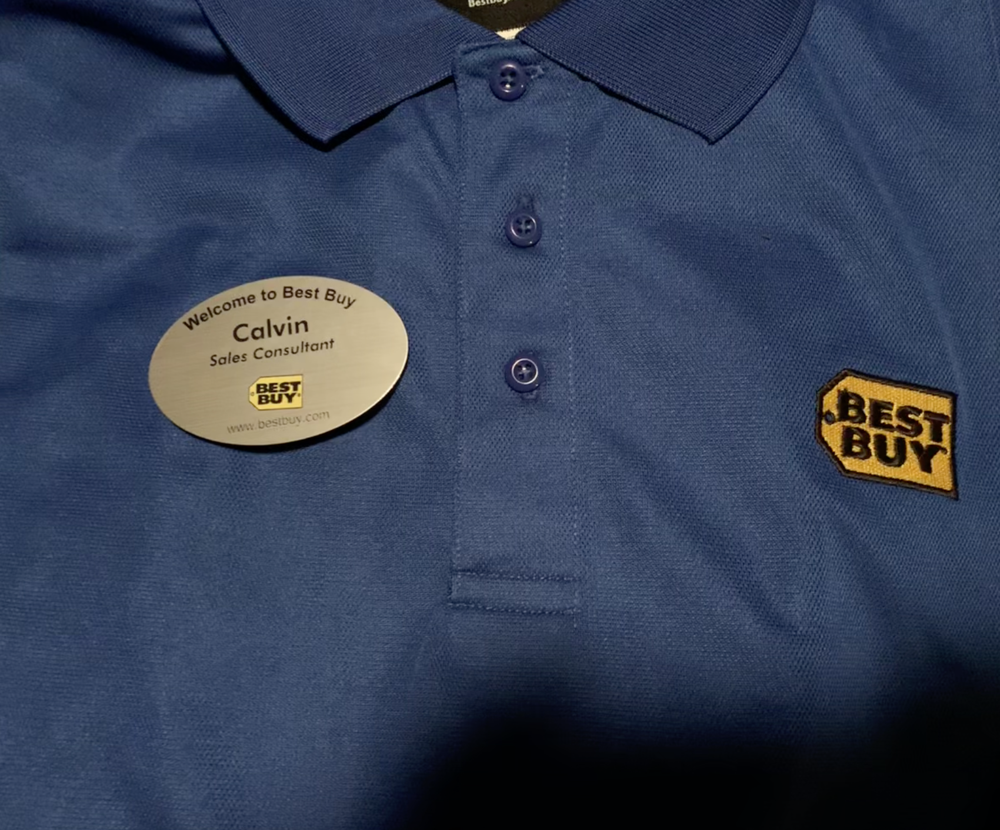
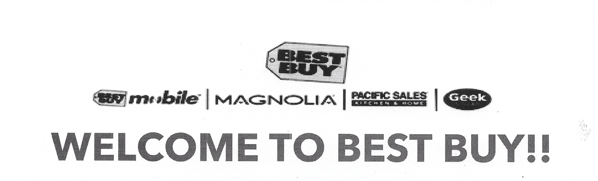

### An Unexpected Party

<p align="center"></p>

Growing up I used to force my. parents to take walks through Best Buy with me so I could see all the new gadgets and technology that was hitting the consumer market. This is also why I loved going to [index](../../../blog/articles/2025/ces_2025/index.md) with my Dad. Those walks definitely played a part in my love for technology and security today. So when I started to look for my first job Best Buy was the obvious choice for me.

### So It Begins

<p align="center"></p>

I started back in August of 2018 as a "[Computer Sales Consultant](../../../about_me/Resume/Best%20Buy%20Timeline.md#Computer%20Sales%20Consultant%20(Store%2011))". The role consisted of working in the computer department which included: Laptops & Desktop Computers, Gaming, Car Audio, Home Networking and more.

Here I got to learn a lot about computer hardware. From CPU's, GPU's, Motherboards and more. This would lead me down the path of diving deeper into [computer hardware](../../../blog/posts/2024/Personal%20Computer%20Timeline.md) and [servers](../../../blog/posts/2025/Creating%20a%20Proxmox%20Automation%20Script.md).

#### Black Friday 2018

<figure align="center"><figcaption>Working my first Best Buy Black Friday in 2018</figcaption></figure>

Working Black Friday's like the one above definitely taught me a lot about working with a team, coordinating and executing plans and communication to technical and non-technical clients. It was important to understand our clients needs and made sure they made the making the best purchase for them.

> [!example]- Black Friday 2018 Story
> Store 11 was connected to a mall and 2 entrances (Main Doors and Mall Doors). During the busy day someone walking to our store from the mall doors holding a huge shopping bag from one of the mall stores. They were casually walking until a mall officer yelled "STOP" to the person. They started to run quickly. The mall officer caught up to said person and tackled them head first like a linebacker getting the quarterback. I remember that day being so load and busy for hours. But that sound of them hitting the floor silenced the entire building.

> [!attention] **Cybersecurity Perspective**: Point of Sale (POS) Endpoint Security
> Learning the Point of Sale (POS) system was a learning curve. But it is important for Bestbuy to make sure this endpoint is secure for its retail employees to access. The POS systems have access to maybe internal tools at Bestbuy and third party managed vendor tools as well. End point security reviews should be a huge part of any organizations security posture.

### The Apple Doesn't Fall Far From The Tree

Being a fan of Apple's hardware and software, and watching [WWDC](../../../blog/articles/2025/wwdc2025/index.md). I quickly became the go-to person to help any of our clients with Apple related questions. This lead to me being promoted to the Apple Computing Specialist for my store. [Best Buy Timeline](../../../about_me/Resume/Best%20Buy%20Timeline.md#Computer%20Sales%20Consultant%20&%20Apple%20Computing%20Specialist%20(Store%2011)). This allowed me to work with Best Buys third party vendor Apple and take custom training modules made by them on their platform.

<figure align="center"></figure>

This showed me the importance of Best Buys third party vendor relationships are for the company as a whole. When these are implemented correctly it allows Best Buy's employees to better learn about their products which in turn makes it a better buying experience for the client. 

> [!attention] **Cybersecurity Perspective**: Third Party Vendors Affect on Best Buy's Security
> From a Cybersecurity perspective its important to Best Buy to make sure these vendors are well vetted and reviewed by their security teams to make sure they don't put the company at risk. This can be done though requesting a [SOC 2](../../../blog/articles/2024/My%20Thoughts%20on%20SOC%202.md) and other compliance reports as well as other vendor due diligence efforts.

### Shifting To Leadership
After moving to Store 12 during my college years. I continued to gain more experience in all departments of the store. This incudes Home Theater, Mobile, Networking, Appliances and more. This allowed me to work with a wider rage of clients and needs. And allowed me to work on my inter-personal skills with clients and fellow new hires I was starting to help train in. Soon after I got promoted to a [shift lead position](../../../about_me/Resume/Best%20Buy%20Timeline.md#Shift%20Lead%20Supervisor%20(Store%2012)). This was a leadership role that allowed me to help the other managers and supervisors managed departments and train in new hires for the holiday season.

Being able to experience interview preparations, employee onboarding and training was a great skills to acquire. I was also given my own keys to the store to help lock up at the end of the night which means I was responsible for making sure over $2 million dollars of inventory was secured before closing. Although stressful at times I am so happy I was given the opportunities in this position.

> [!attention] **Cybersecurity Perspective**: How Third-Party Issues Impact Operations and Customer Trust
> While helping out other departments such as the Mobile department it showed me how third-party issues can affect operations at your organization and customer trust. One of these moments was when a telecommunications provider's account system went down. Which caused issues with getting customers phone plans activated, thankfully Bestbuy had failover procedures for these situations documented for employees to use. It is important for your organization to have business continuity plans for core services and be aware how thrid party integrations can affect operational efficiency.

### The Last Stage

Overall...

> [!cite]- Article Permalink
> ```
> blog.calvinschmeichel.com/FF4FBE4F-76FF-4498-9AD2-08E53AE80CA2
> ```