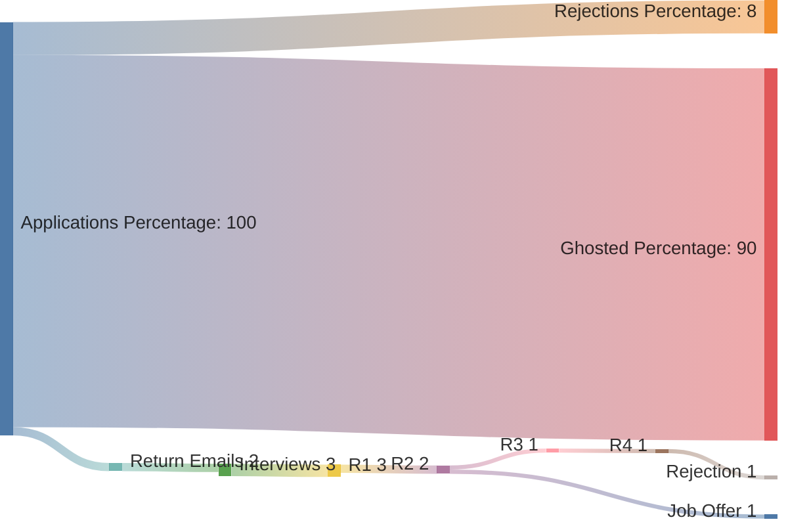

### A Storm is Coming

As my previous contract engagement completed on a very good note back in August of 2025, I was once again back on the job hunt. As many of you know the current job market was, and still is, not in a great spot. With countless lay-offs from major companies, rising inflation, and other economic factors, it started brewing an unemployment storm.

Lets just say it wasn't easy during this time. It was a grind, discouraging at times, and exhausting. I wanted to share my story and experience during this time and showcase some of the fun projects I got to work on with the extra time I had on my hands.

### The Grind

First, I wanted to cover my job application strategy. To keep things organized, I created a Google Sheets file to keep track of all my applications:

| Company | Status | Title | Where | Type | Date | Link |
| ------- | ------ | ----- | ----- | ---- | ---- | ---- |

This was helpful to keep track of what jobs I have applied to and keep metrics on what types of jobs I was getting results with.

Here is a simulated rendition of the percentage ratios in the dataset I collected:

###### Chart

As you can see, it was not very fun. Lots of rejections and ghostings unfortunately (Over 98%). As a someone who only graduated less then 2 years ago, this was very discouraging to see, especially from job opportunities I thought I would be great in. Or at least given the chance I know I would learn fast and work hard at.

### Any Tech Tips?

Unfortunately, I don't have many sadly. I think the current job market is partially a numbers game. As in you just have to keep applying. You also can't dwell on picking the perfect job to apply for. You gotta look at the description, company and role, and if it meets your skill set and interests, I would apply for it.

#### Resume
Another tip is to update your resume per application. Look for keywords that you can leverage and help stand out. Does the role mention "*Security Operations*" and you passed Security Plus? Then mention in your resume how "Security Operations" is one of the domains for that certification. Small changes like that can really help you stand out and get passed the dreaded "***Filter***".

#### The Power of AI
They keep saying AI is going to replace all the jobs, right? Well, I am not sure what's going to happen on that front but what I can say is AI can be a powerful tool during the interview process. I used AI platforms such as ChatGPT to help me generate interview questions and scenarios to help me practice answering and sharing stories from past career experiences.

> If you have privacy concerns about using public AI platforms (Which totally makes sense) you can also self host! Like what I did here: [Proxmox VM Docker ollama install](../../../blog/posts/2025/llm_docker_tailscale_update.md)

#### Friends!
Ask your friends to review your resume and help give mock interviews. Talking to another person can help you develop your soft skills and prepared to answer anything that gets thrown at you.

#### Be Lucky
Unfortunately, a lot of the time it is luck... Whether its a company you know, someone you know, or just right place right time... but...

> [!quote] Lucius Annaeus Seneca
> "*Luck is what happens when preparation meets opportunity*"

I am a firm believer that if you put in the time and work, eventually things will go your way. But these things can take time. You gotta keep rolling with the punches.

### "Explain the Gap in Your Resume"
So, what else did I do during my time? Sleep in late and miss the McDonalds breakfast? Or did I try to expand my IT and Cyber skills with all this extra time? Well, multiple things can be true at once.

So here is a brief summary of some of the things I did over my break:

#### Attend Industry Shows

##### DEF CON
Less then one week into unemployment, I had the opportunity to fly to Vegas for my first ever DEF CON for [DEF CON 33](../../../blog/articles/2025/def_con_33/index.md). This was a great time with some close friends from college. We also had the opportunity to meet and network with many other great people in the industry (Such as [FRSecure](https://frsecure.com/)).

##### Hacks and Hops
After doing some networking with my new friends at FRSecure, I got invited to their 2025 [Hacks and Hops](../../../blog/articles/2025/frsecure_hacks_hops_2025/index.md) cybersecurity event at the [Minneapolis Target Center](https://www.targetcenter.com/connect-with-us/about-target-center). Here, I got to meet more awesome members from FRSecure and their sponsors which was great. As well as learn more about industry trends via their [State of the Union](../../../blog/articles/2025/frsecure_hacks_hops_2025/index.md#Tip-Off%20State%20of%20the%20Union)

##### CES
Finally, I once again made the journey back to Vegas to attend the [Consumer Electronic Show for 2026](../../../blog/articles/2026/ces_2026/index.md). This was an awesome trip to get up to speed on all the current industry trends in the consumer market.

> (*[Still can't wait for that OLED Monitor ](../../../blog/articles/2026/ces_2026/index.md#ASUS%20ROG%20Swift%20OLED%20PG27UCWM)*).

#### Cover Industry Events
During my break I was able to deep dive into the major [AWS Outage of 2025](../../../blog/articles/2025/aws_outage_oct_2025.md). As someone who recently got their [AWS Certified Solutions Architect Associate Cloud Certification](../../../blog/articles/2025/saa-c03/index.md), it was fun to leverage that knowledge and dive deep into a report about the root causes of the outage.

#### Continued Construction of my Homelab
I also got to work on some fun technical projects as well during my break. It was nice having the extra time to dive deep into these subjects and to really try to understand how these systems work.

##### Automation
My first project was learning about how to configure GPU passthrough on a Proxmox server for a virtual machine. It was not easy and the steps were really long and fully manual to configure. I had to do this every time I wanted to create a new machine from scratch. This is where I got to explore `cloud-init` packages and [Proxmox QM Bash Scripting](../../../blog/posts/2025/Creating%20a%20Proxmox%20Automation%20Script.md). This was a fun project to get working and I still use this script to this day!

##### Plex Media Server with Intel ARC GPU Hardware Encoding
I like to make video projects from time to time, whether it was for a school project or other events. I wanted a better way to view these files without uploading them to an externally hosted platform such as YouTube or Vimeo. That's when I remembered the Plex product.

After some research and work I was able to deploy a Plex Media Server via Docker on my NAS. This was great but relied on CPU media encoding for remote streaming. In most cases, this was fine but if I wanted to play some of video projects in higher quality without it buffering, not so much. This lead me down the rabbit hole of AV1 hardware encoding with Intel ARC GPU's... But that's a story for another day. (*Another blog post perhaps?*). In the end I deployed the new hardware and I got Plex hardware transcoding working in real time.

##### Remote Machine Learning Server with Immich
After learning that the self hosted Photos app I was already running on my NAS had support for [Remote Machine Learning](https://docs.immich.app/guides/remote-machine-learning/), I knew I had to try it out. Again a longer story for another day... (*Another Another blog post perhaps?*). After some networking troubleshooting I was able to deploy the AI Docker cluster on my Proxmox homelab server.

##### Re-Deployed my Self Hosted LLM Chat Bot
After moving my main server from Windows 11 to Proxmox I was able to [re-deploy my AI LLM Ollama Sandbox environment](../../../blog/posts/2025/llm_docker_tailscale_update.md) to my Proxmox server (Via my Bash script from above). This was great practice to learn more about service and data migrations as well as making sure configuration changes are documented.

#### This Website!
I made it a goal to try and write at least one high quality #Article about every month or so during my break. Here is the breakdown of how I did:

| Count | Month    | Article                                                                                                                |
| ----- | -------- | ---------------------------------------------------------------------------------------------------------------------- |
| 1     | August   | [defcon33](../../../blog/articles/2025/def_con_33/index.md)                                                            |
| 2     | August   | [proxmox ai script](../../../blog/posts/2025/Creating%20a%20Proxmox%20Automation%20Script.md)                          |
| 3     | October  | [aws_outage_oct_2025](../../../blog/articles/2025/aws_outage_oct_2025.md)                                              |
| 4     | October  | [ollama update](../../../blog/posts/2025/llm_docker_tailscale_update.md) |
| 5     | October  | [hacks and hops](../../../blog/articles/2025/frsecure_hacks_hops_2025/index.md)                                        |
| 6     | December | [My Time at Best Buy](../../../blog/articles/2025/my_time_at_bestbuy/index.md)                                         |
| 7     | January  | [CES 2026](../../../blog/articles/2026/ces_2026/index.md)                                                              |

Overall, I think I did pretty well at keeping my average around 1 per month. This was a great opportunity to expand my web and writing skills. I also did some refactoring my website to us relative links vs full/absolute links which allowed for better organization of my media image pathing.

### A New Chapter
This break came to a close with my recent announcement: [Best Buy: The Journey Continues](../../../blog/posts/2026/best_buy_job/index.md). I am excited to dive into some new professional work and learn more about third party risk.

Looking back at this time, I am grateful for the opportunity I had to focus on some of my backlog of projects. It helped me stay informed and excited about new innovations in technology and security. I am excited to continue my work on my own time and explore more projects. I will definitely be documenting all my experiences here so stay tuned!